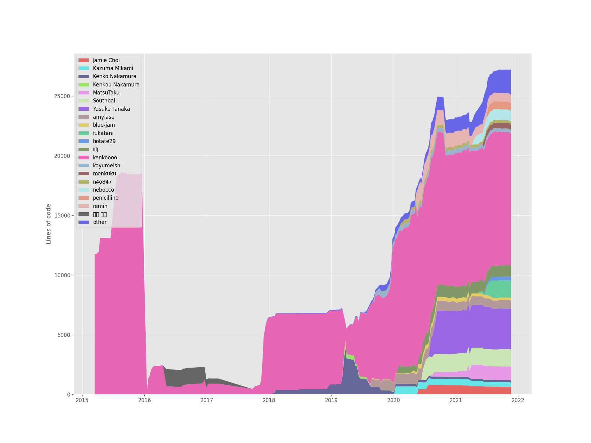
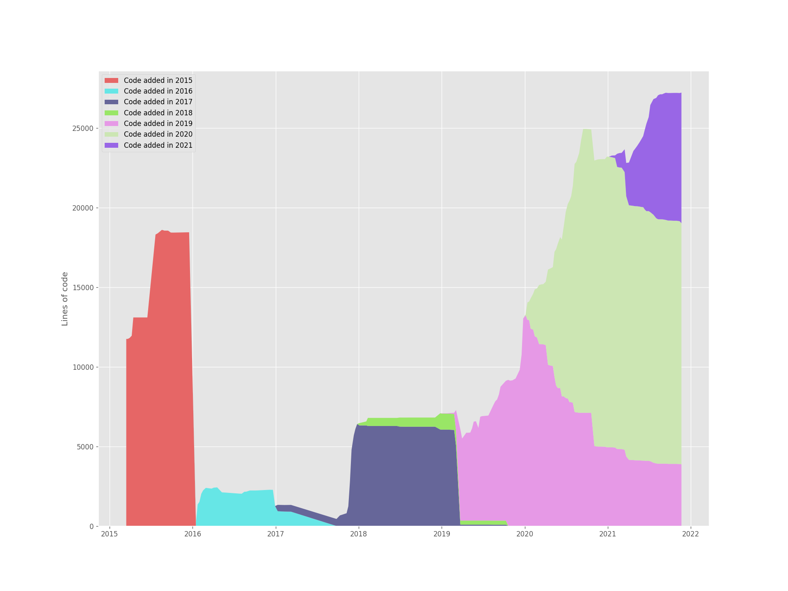
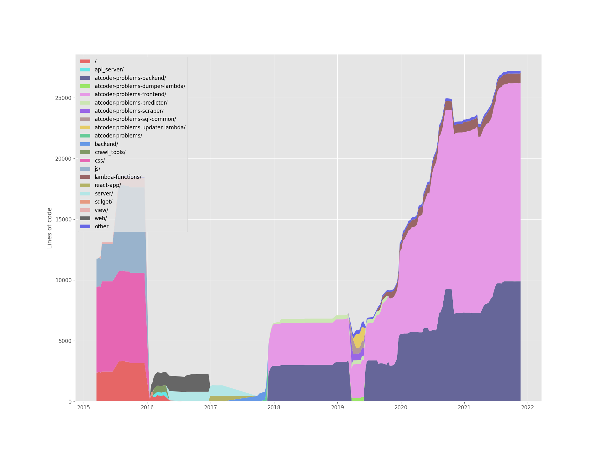
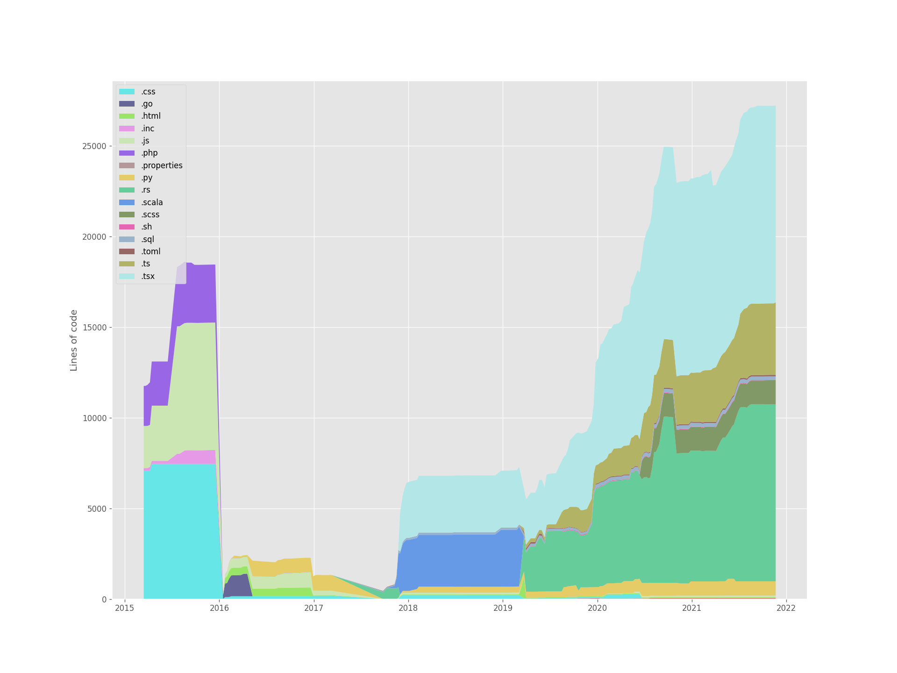

# Test git-of-theseus

Test of [git-of-theseus](https://github.com/erikbern/git-of-theseus), a tool to analyze Git repositories.

## Prerequisites

- Python 2.7.12 >
  - follow the [`Dockerfile` in `git-of-theseus`](https://github.com/erikbern/git-of-theseus/blob/master/Dockerfile)

Although Python version in my local environment is 3.9.5, `git-of-theseus` works fine.

## Preparation

Install `git-of-theseus`

```sh
pip install git-of-theseus
```

## Execute

1. Clone a Git repository
2. Set environment variables in `.env`:
   - `PATH_TO_REPOSITORY`: path to a cloned repository
   - `ANALYSIS_TARGET_BRANCH`: branch name of target of analysis by `git-of-theseus`
   - `REPOSITORY_ID`: an arbitrary string used to output directory name
3. Execute analysis by following commands:
   ```sh
   make analyze
   make stack-plot
   ```

### Example

In this example, [kenkoooo/AtCoderProblems](https://github.com/kenkoooo/AtCoderProblems) is analyzed:

```sh
# Clone this repository
git clone git@github.com:nukopy/test-git-of-theseus.git
cd test-git-of-theseus

# 1. Clone example repository (any repository you want to analyze)
cd repositories
git clone git@github.com:kenkoooo/AtCoderProblems.git # example repository
cd ../

# 2. Set environment variables in .env
vi .env
# --- in .env ---
# PATH_TO_REPOSITORY = repositories/AtCoderProblems
# ANALYSIS_TARGET_BRANCH = master
# REPOSITORY_ID = atcoder-stream

# 3. Execute analysis
make analyze
make stack-plot
```

Results of analysis is here:

- Stack plot of lines of code by authors



- Stack plot of lines of code by years



- Stack plot of lines of code by directories



- Stack plot of lines of code by file extensions


